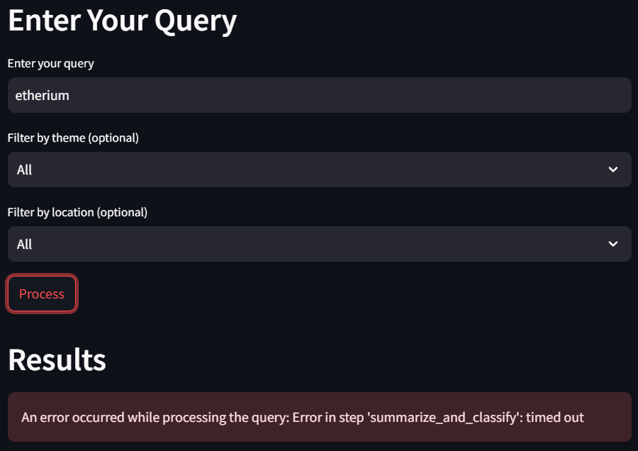

# **Project Description**

The **Daily News Summarizer and Analyst** aims to provide concise, categorized, and sentiment-analyzed news summaries based on user-provided themes or locations. The project will:

1. Fetch news articles dynamically via APIs or RSS feeds.
2. Store articles in a VectorStore for querying.
3. Use **llama3.2:3b** (local LLM) to:
    - Summarize articles.
    - Categorize them by themes or regions.
    - Perform sentiment analysis. (Positive, Neutral or negative News)
4. Present results to users in an interactive format (web interface).

This project leverages **12GB of VRAM** provided by Google Cloud for running Ollama locally.
This project uses Streamlit as a framework for the user's web interface.

# Install
1. Install ollama and llama3.2:3b
```
curl -fsSL https://ollama.com/install.sh | sh
ollama serve&
```
```
ollama run llama3.2:3b
```
2. Clone this repository and install.
```
git clone https://github.com/belnad/AI_LLM.git && cd AI_LLM
python setup.py
```
3. If the streamlit command doesn't work, use this command instead:
```
python -m streamlit run app/frontend.py 
```
# troubleshooting

We use **llama3.2:3b** who is low.
So if you encounter this error, just click on **Process** untill you get a result. 