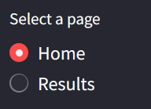
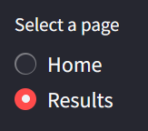

# Streamlit Article Summarizer

This project uses Streamlit as a framework for the user's web interface.

## How to Run
1. Clone this repository.

### How to use the web interface

1. Install: pip install streamlit
2. Run: streamlit run users_CLI.py
3. If the command above doesn't work, use this command instead: python -m streamlit run users_CLI.py 
4. You can switch between the home page and the results page with the navigation bar at the left of the website

5. You doesn't need to fill all the section of the home page to have a result (one is enough, but to improve the results you can fill all the section)

6. To see the results of your search once you've clicked on the process button, click on the results button in the navigation bar.

